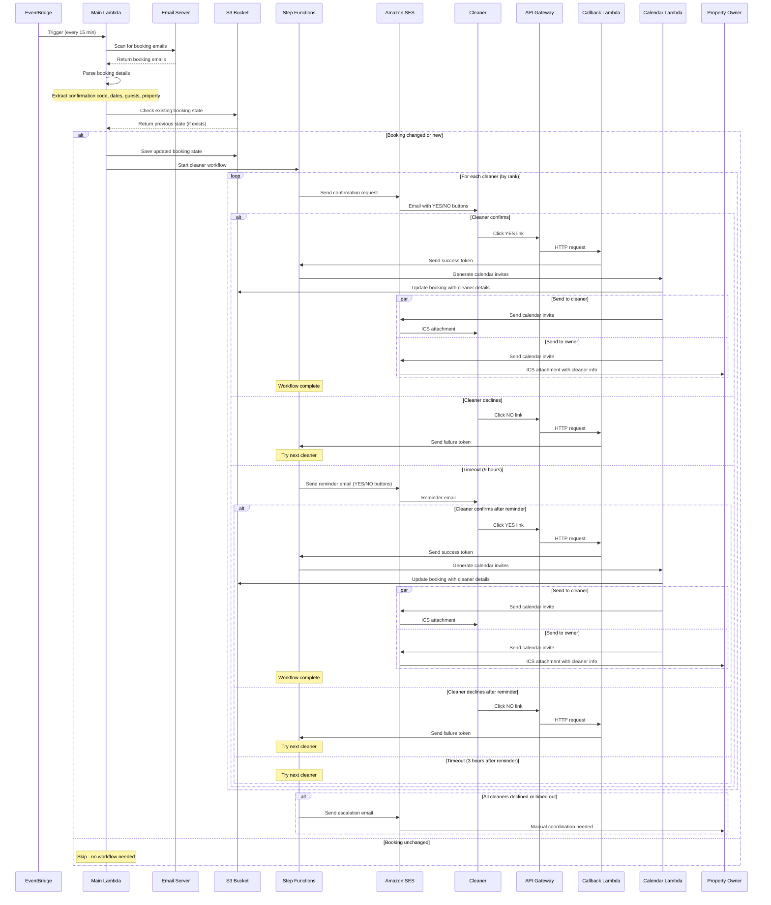
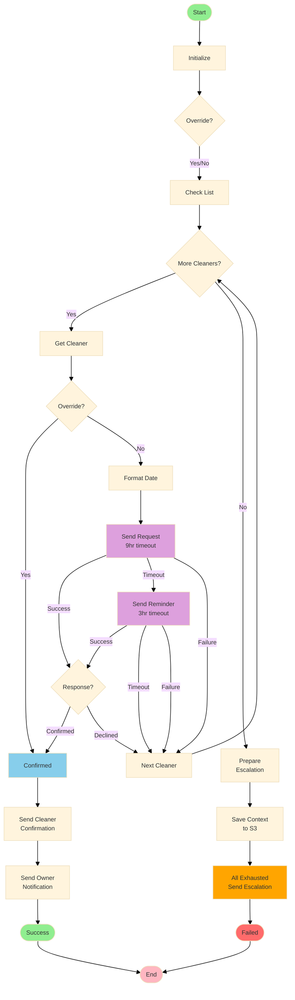

# Rental Turn Manager

A serverless AWS application for automating rental property turnover scheduling by monitoring booking emails and coordinating with cleaning staff.

## Overview

Rental Turn Manager automates the process of scheduling property cleanings when new bookings are received. It monitors an IMAP email account for booking confirmations from platforms like Airbnb, VRBO, and Booking.com, then automatically contacts preferred cleaners to schedule turnovers.

## Features

- **Email Monitoring**: Scans IMAP inbox for all booking confirmations on a scheduled basis
- **Multi-Platform Support**: Parses bookings from Airbnb, VRBO, and Booking.com
- **Smart Booking Tracking**: Uses S3 to track booking state and prevent duplicate processing. The Step Function now references the booking state bucket at the root of the input object, fixing previous workflow errors related to JSONPath.
- **Change Detection**: Automatically detects booking modifications and re-triggers workflows
- **Automated Cleaner Coordination**: Contacts cleaners in priority order via email with confirm/deny links. Each cleaner can also have a `phoneEmail` property (e.g., `1234567890@vtext.com` for Verizon, `1234567890@txt.att.net` for AT&T, etc.) to receive SMS text notifications via email. As of January 2026, the system now sends these notifications as BCC (not CC) for privacy.
- **Alternative Time Scheduling**: When a cleaner can't make the default time, they can select from up to 5 alternative time slots provided in the email. The system automatically adjusts times based on configurable intervals and ensures slots don't conflict with the cleaning duration.
- **Owner Override Capability**: Property owners can manually schedule or cancel cleanings using a secure token-based override system when all cleaners are unavailable
- **Cleaning Cancellation**: Property owners can cancel scheduled cleanings via a cancel link in the owner notification email, which automatically sends cancellation notices with ICS calendar updates to both the cleaner and owner
- **Enhanced Error Handling**: User-friendly HTML error pages for expired or used callback links with owner contact information and accessibility features (ARIA attributes, proper semantic HTML)
- **Calendar Integration**: Sends ICS calendar invites with proper timezone handling to cleaners and owners
- **Property Configuration**: Maintains property metadata, addresses, and cleaner preferences
- **Multi-Environment**: Supports dev and prod deployments with GitHub Actions
- **Secure Credentials**: Uses AWS Secrets Manager for email credentials and owner override tokens



## Project Structure

```
RentalTurnManager/
├── src/
│   ├── RentalTurnManager.Lambda/          # Main email scanning Lambda
│   ├── RentalTurnManager.CalendarLambda/  # Calendar invite generator
│   ├── RentalTurnManager.CallbackLambda/  # Cleaner response handler
│   ├── RentalTurnManager.Core/            # Core business logic and services
│   │   └── Services/                      # Email scanner, booking parser, state management
│   ├── RentalTurnManager.Models/          # Data models and DTOs
│   └── RentalTurnManager.Tests/           # Unit tests with xUnit
├── infrastructure/
│   ├── cloudformation/
│   │   ├── main.yaml                      # CloudFormation template (all resources)
│   │   └── parameters/
│   │       ├── dev.json                   # Dev environment parameters
│   │       └── prod.json                  # Prod environment parameters
│   └── stepfunctions/
│       └── cleaner-workflow.json          # Step Functions state machine definition
├── .github/
│   └── workflows/
│       └── deploy.yml                     # CI/CD pipeline (build, test, deploy)
├── config/
│   ├── properties.json                    # Property configurations (generated from GitHub variable)
│   └── message-templates.json             # Email message templates
└── README.md
```

## Step Functions Workflow

The cleaner coordination workflow is managed by AWS Step Functions with the following state flow:



### Workflow States Explained

- **InitializeState**: Sets up initial workflow state with `cleanerConfirmed: false` and `allCleanersExhausted: false`
- **CheckOwnerOverride**: Determines if this is a manual owner override (when owner manually selects cleaner from escalation email)
- **CheckCleanerList**: Gets the total count of available cleaners for the property
- **CompareCleanerIndex**: Checks if there are more cleaners to try
- **GetCurrentCleaner**: Extracts the current cleaner's information from the property configuration
- **CheckForOwnerOverride**: If owner override, skip email request and go straight to confirmation
- **FormatCleaningDate**: Reformats dates for display in emails (YYYY-MM-DD to MM-DD-YYYY)
- **SendCleanerRequest**: Sends email to cleaner with YES/NO callback links, waits up to 9 hours for response
- **SendReminderEmail**: If no response after 9 hours, sends reminder email and waits 3 more hours
- **EvaluateReminderResponse**: Checks if cleaner confirmed or declined after reminder
- **IncrementCleanerIndex**: Moves to the next cleaner in the list
- **PrepareEscalation**: Prepares data for escalation email when all cleaners are exhausted
- **SaveWorkflowContext**: Saves complete workflow state to S3 for potential owner override restart
- **AllCleanersExhausted**: Sends escalation email to owner with manual scheduling options
- **CleanerConfirmed**: Marks the workflow as having a confirmed cleaner
- **SendCleanerConfirmation**: Sends confirmation email with calendar invite to the cleaner
- **SendOwnerNotification**: Sends notification email with calendar invite to the property owner

### Owner Override Flow

When all cleaners are exhausted, the owner receives an escalation email with "Schedule This Cleaner" buttons. When clicked:

1. Owner clicks button → Callback Lambda validates secure token
2. Lambda retrieves saved workflow context from S3
3. Lambda restarts workflow with selected cleaner and `ownerOverride: true`
4. Workflow skips cleaner request email and goes directly to confirmation emails

### Cleaning Cancellation Flow

When a cleaning is scheduled, the owner receives a notification email with a "Cancel this cleaning" link. When clicked:

1. Owner clicks cancel link → Callback Lambda validates secure token
2. Lambda retrieves booking from S3 and marks it as cancelled
3. Lambda adds/updates `AssignedCleanerId` and `WorkflowPropertyId` fields in booking
4. Lambda sends cancellation emails with calendar updates (ICS METHOD:CANCEL) to:
   - **Cleaner**: Notifies them the appointment is cancelled with details
   - **Owner**: Confirms the cancellation with cleaner and appointment details
5. Calendar applications automatically remove the cancelled event
6. Booking state is saved to S3 with `CleaningStatus: "cancelled"` and `CancelledAt` timestamp

The cancel link includes the cleaner ID and property ID, allowing the system to send detailed cancellation notices even if the cleaner hasn't been fully assigned yet in the booking state.

## Setup

### Prerequisites

1. **AWS Account**: Active AWS account with appropriate permissions
2. **.NET 10 SDK**: Install from https://dotnet.microsoft.com/download
3. **GitHub Account**: For hosting code and running CI/CD
4. **IMAP Email Account**: Gmail, iCloud, or other IMAP-enabled email provider

### Initial Configuration


#### 1. GitHub Secrets

Navigate to your GitHub repository → Settings → Secrets and variables → Actions

Add the following **secrets**:

- `EMAIL_USERNAME`: IMAP email account username
- `EMAIL_PASSWORD`: IMAP email account password (use app-specific password for Gmail/iCloud)
- `AWS_ACCOUNT_ID`: Your AWS account ID (12-digit number)
- `IMAP_HOST`: IMAP server hostname (e.g., `imap.gmail.com`, `imap.mail.me.com`)
- `OWNER_EMAIL`: Property owner email address
- `OWNER_OVERRIDE_TOKEN`: Secure token for owner override capability (generate a random 32+ character string)
- `PROPERTIES_CONFIG_DEV`: JSON string with property configurations for dev environment (see below)
- `PROPERTIES_CONFIG`: JSON string with property configurations for prod environment (see below)

#### 2. GitHub Variables

Add the following **variables**:

**Required:**
- `AWS_REGION`: AWS region (e.g., `us-east-1`)
- `OIDC_ROLE_NAME`: `GitHubActionsOIDCRole` (IAM role for GitHub Actions)

**Optional (with defaults):**
- `NAMESPACE_PREFIX`: Resource name prefix (default: `bf`)
- `OWNER_NAME`: Property owner name (default: `Property Owner`)
- `IMAP_PORT`: IMAP port (default: `993`)
- `SCHEDULE_INTERVAL`: Lambda schedule (default: `rate(15 minutes)`)
- `APP_NAME`: Application name (default: `RentalTurnManager`)
- `APP_DESCRIPTION`: Application description (default: `Rental property turnover management system`)

#### 3. Properties Configuration

Create two GitHub secrets for your rental property configurations:

**`PROPERTIES_CONFIG_DEV`**: Dev environment configuration (used when deploying to dev branch)
**`PROPERTIES_CONFIG`**: Production environment configuration (used when deploying to main branch)

Both should contain JSON in this format:

```json
{
  "properties": [
    {
      "propertyId": "unique-property-id",
      "platformIds": {
        "airbnb": "YOUR_AIRBNB_LISTING_ID",
        "vrbo": "YOUR_VRBO_PROPERTY_ID",
        "bookingcom": "YOUR_BOOKING_COM_ID"
      },
      "address": "123 Main St, City, State 12345",
      "cleaners": [
        {
          "cleanerId": "primary-cleaner-id",
          "name": "Primary Cleaner",
          "email": "cleaner1@example.com",
          "phone": "+1-555-0100",
          "phoneEmail": "1234567890@vtext.com",
          "rank": 1
        },
        {
          "cleanerId": "backup-cleaner-id",
          "name": "Backup Cleaner",
          "email": "cleaner2@example.com",
          "phone": "+1-555-0200",
          "phoneEmail": "1234567890@txt.att.net",
          "rank": 2
        }
      ],
      "metadata": {
        "propertyName": "Beach House",
        "bedrooms": 3,
        "bathrooms": 2,
        "cleaningDuration": "3 hours",
        "marginMinutesAfterCheckOut": 60,
        "alternateTimeIncrementMinutes": 30,
        "accessInstructions": "Lockbox code: 1234",
        "specialInstructions": "Clean refrigerator thoroughly"
      }
    }
  ],
  "emailFilters": {
    "bookingPlatformFromAddresses": ["airbnb.com", "vrbo.com", "booking.com"],
    "subjectPatterns": ["Reservation confirmed", "Instant Booking from", "booking confirmation"]
  }
}
```

### Cleaner Configuration

Each cleaner object requires the following fields:

- **`cleanerId`** (required): Unique identifier for the cleaner, used in owner override URLs
- **`name`** (required): Cleaner's full name
- **`email`** (required): Cleaner's email address for notifications
- **`phone`** (required): Cleaner's phone number
- **`phoneEmail`** (optional): Email-to-SMS gateway address for text notifications (e.g., `1234567890@vtext.com` for Verizon)
- **`rank`** (required): Priority order (1 = highest priority)

#### Cleaner SMS/Text Notification (phoneEmail)

The optional `phoneEmail` property should be a valid email-to-SMS gateway address for the cleaner's mobile carrier. When present, the system will BCC this address on cleaner notification emails, allowing the cleaner to receive a text message alert while keeping the address private from other recipients.

**Examples:**

- Verizon: `1234567890@vtext.com`
- AT&T: `1234567890@txt.att.net`
- T-Mobile: `1234567890@tmomail.net`
- Sprint: `1234567890@messaging.sprintpcs.com`

This enables real-time SMS notifications for cleaners in addition to standard email.

#### Property Metadata

The `metadata` object within each property configuration supports the following optional fields for alternative time scheduling:

- **`marginMinutesAfterCheckOut`** (optional, default: 60): Minutes after checkout time to schedule default cleaning time. For example, if checkout is at 11:00 AM and margin is 60, default cleaning time is 12:00 PM.
- **`alternateTimeIncrementMinutes`** (optional, default: 30): Interval between alternative time slots in minutes. The system generates up to 5 alternative times at this increment after the default time.

**Example Configuration:**
```json
"metadata": {
  "propertyName": "Beach House",
  "cleaningDuration": "3 hours",
  "marginMinutesAfterCheckOut": 60,
  "alternateTimeIncrementMinutes": 30
}
```

With this configuration:
- Checkout: 11:00 AM
- Default cleaning: 12:00 PM (11:00 + 60 minutes)
- Alternative times: 12:30 PM, 1:00 PM, 1:30 PM, 2:00 PM, 2:30 PM (5 slots at 30-minute increments)

**Note**: The system automatically ensures alternative times don't conflict with the checkout time plus cleaning duration. If a slot would overlap, it's skipped.

**Note**: Store these as single-line JSON strings in the GitHub secrets. The deployment workflow will automatically select the appropriate configuration based on the environment (dev or prod) and write it to `config/properties.json`.

#### 4. Email Provider Setup

**For Gmail:**
1. Enable IMAP in Gmail settings
2. Enable 2-Step Verification
3. Create an App Password: Google Account → Security → App passwords
4. Use the app password as `EMAIL_PASSWORD`

**For iCloud:**
1. Enable IMAP in iCloud Mail settings
2. Generate an app-specific password at appleid.apple.com
3. Use `imap.mail.me.com` as `IMAP_HOST`

**For Other Providers:**
- Verify IMAP is enabled
- Use correct host and port (usually 993 for SSL)
- May require app-specific passwords

#### 5. AWS SES Configuration

Configure Amazon SES to send emails:

```bash
# Verify sender email (owner)
aws ses verify-email-identity --email-address your-owner@example.com --region us-east-1

# If in SES sandbox mode, also verify recipient emails
aws ses verify-email-identity --email-address cleaner@example.com --region us-east-1

# Request production access (optional - removes sandbox restrictions)
# AWS Console → SES → Account dashboard → Request production access
```

## Deployment

Deployment is fully automated via GitHub Actions using OIDC authentication (no long-lived AWS credentials required).

### Deploy to Dev Environment

```bash
# Push to develop branch
git checkout develop
git push origin develop
```

This triggers the CI/CD pipeline which:
1. Builds the .NET solution
2. Runs all unit tests
3. Packages Lambda functions
4. Deploys CloudFormation stack to dev environment

### Deploy to Production

```bash
# Merge to main branch
git checkout main
git merge develop
git push origin main

# Or create a release tag
git tag -a v1.0.0 -m "Release version 1.0.0"
git push origin v1.0.0
```

### Manual Deployment (Optional)

If you need to deploy manually:

```bash
# Build and package
dotnet build src/RentalTurnManager.sln --configuration Release
dotnet publish src/RentalTurnManager.Lambda --configuration Release -o ./publish/main
dotnet publish src/RentalTurnManager.CalendarLambda --configuration Release -o ./publish/calendar
dotnet publish src/RentalTurnManager.CallbackLambda --configuration Release -o ./publish/callback

# Package for Lambda
cd publish/main && zip -r ../../lambda-main.zip . && cd ../..
cd publish/calendar && zip -r ../../lambda-calendar.zip . && cd ../..
cd publish/callback && zip -r ../../lambda-callback.zip . && cd ../..

# Deploy CloudFormation stack
aws cloudformation deploy \
  --template-file infrastructure/cloudformation/main.yaml \
  --stack-name RentalTurnManager-dev \
  --parameter-overrides file://infrastructure/cloudformation/parameters/dev.json \
  --capabilities CAPABILITY_NAMED_IAM
```

## Development

### Local Setup

```bash
# Clone repository
git clone https://github.com/YOUR_USERNAME/RentalTurnManager.git
cd RentalTurnManager

# Restore dependencies
dotnet restore src/RentalTurnManager.sln

# Build solution
dotnet build src/RentalTurnManager.sln
```

### Testing

```bash
# Run all tests
dotnet test src/RentalTurnManager.sln

# Run with code coverage
dotnet test src/RentalTurnManager.sln --collect:"XPlat Code Coverage"

# Run specific test class
dotnet test --filter FullyQualifiedName~BookingParserServiceTests

# Run in watch mode for development
dotnet watch test --project src/RentalTurnManager.Tests
```

### Code Standards

- **Style**: Follow Microsoft C# coding conventions
- **Documentation**: Add XML comments for public APIs
- **Testing**: Maintain 80%+ code coverage
- **Commits**: Use conventional commit format (`feat:`, `fix:`, `docs:`, etc.)
- **File Headers**: All files include header comments with purpose, author, and date

### Running Locally

```bash
# Test Lambda with SAM CLI
sam local invoke EmailScannerLambda --event test-event.json

# Or manually invoke deployed Lambda
aws lambda invoke \
  --function-name RentalTurnManager-EmailScanner-dev \
  --payload '{"forceRescan":false}' \
  response.json && cat response.json
```

## How It Works

### Email Processing Workflow

1. **Scheduled Execution**: EventBridge triggers Main Lambda on configured interval (default: every 15 minutes)
2. **Email Scanning**: Lambda connects to IMAP inbox and retrieves all booking emails (not just unread)
3. **Booking Parsing**: 
   - Extracts confirmation codes (e.g., `HMFMAQS9MB` for Airbnb)
   - Parses dates, guest counts (adults + children), property IDs
   - Handles multiple email formats from Airbnb, VRBO, Booking.com
4. **State Management**:
   - Checks S3 for existing booking state (`bookings/{platform}/{confirmationCode}.json`)
   - Compares booking details to detect changes (dates, guests, property)
   - Skips unchanged bookings to prevent duplicate workflows
5. **Property Matching**: Looks up property configuration using platform-specific listing IDs
6. **Workflow Trigger**: Starts Step Functions workflow with booking and property details


### Cleaner Coordination Workflow (Updated)

1. **Initial Contact**: Step Functions sends email to highest-ranked cleaner with YES/NO buttons and up to 5 alternative time slot buttons. If the cleaner has a `phoneEmail`, it is included as a BCC for SMS notification.
2. **Callback Wait**: Workflow pauses using task token, waiting for HTTP callback from cleaner.
3. **Response Processing**:
  - **YES**: Calendar Lambda generates ICS invites for cleaner and owner at the default time (calculated from checkout time + configurable margin)
  - **NO**: Workflow contacts next cleaner in ranked list
  - **Alternative Time**: Cleaner selects one of the provided time slots, workflow updates the scheduled time and generates calendar invites with the new time
  - **Timeout (9 hours)**: Sends a reminder email to the cleaner (with YES/NO buttons and alternative time slots), waits an additional 3 hours for a response
  - **Reminder Response**:
    - **YES**: Calendar Lambda generates ICS invites
    - **NO**: Workflow contacts next cleaner
    - **Alternative Time**: Workflow updates time and generates invites
    - **Timeout (3 hours after reminder)**: Workflow contacts next cleaner
4. **Alternative Time Slots**: 
  - Default time calculated from checkout + `marginMinutesAfterCheckOut` (default 60 minutes)
  - Up to 5 slots generated at configurable intervals (`alternateTimeIncrementMinutes`, default 30 minutes)
  - Automatically adjusts to avoid conflicts with cleaning duration
  - Times displayed in Eastern Time (12:45 PM format) for readability
  - Empty slots hidden from cleaner to avoid visual clutter
5. **Calendar Invites**: 
  - Includes property address, guest details, cleaning duration
  - Shows selected time (default or alternative) in Eastern Time
  - Adds cleaner as required participant, owner as optional participant
  - Proper timezone conversion (Eastern Time)
  - Sent via Amazon SES with raw MIME format
6. **Escalation**: If all cleaners decline or timeout, sends escalation email to property owner with:
  - Complete booking details and attempted cleaner list
  - **Owner Override Buttons**: Pre-formatted links to manually schedule specific cleaners or cancel the cleaning
  - Secure token-based authentication (no login required, just click the link)
  - Professional HTML formatting with visual hierarchy and call-to-action styling

#### Email Button Labels

- Both the initial and reminder emails now use simple "YES" and "NO" buttons for cleaner responses.

#### Owner Override Capability

When all cleaners are unavailable, the escalation email includes secure override buttons that allow the property owner to:

- **Schedule Specific Cleaner**: Manually assign the cleaning to a specific cleaner (bypasses their response)
- **Cancel Cleaning**: Mark the cleaning as cancelled/not needed

The override system:
- Uses a secure token stored in AWS Secrets Manager (`OWNER_OVERRIDE_TOKEN` GitHub secret)
- Authenticates via URL parameter (no login required)
- Returns user-friendly HTML success/error pages
- Integrates with Step Functions to trigger calendar invites when scheduling
- Includes XSS protection (HTML encoding) and accessibility features (ARIA attributes, semantic HTML)

**Override URL Format:**
```
https://{api-gateway-url}/respond?ownerToken={token}&action=schedule&cleanerId={cleanerId}&propertyId={propertyId}&bookingRef={bookingRef}
```

**Actions:**
- `action=schedule`: Schedules the specified cleaner
- `action=cancel`: Cancels/skips the cleaning

#### Callback Error Handling

When cleaners click expired or already-used callback links, they receive:
- **Professional HTML error page** with proper styling and responsive design
- **Specific error messages**:
  - "This link has expired" for timeout scenarios
  - "A response has already been received" for duplicate clicks
- **Owner contact information** from the `OWNER_EMAIL` environment variable
- **Accessibility features**: ARIA live regions, semantic HTML, proper language attributes
- **XSS protection**: All dynamic content is HTML-encoded

#### Dev Environment Scheduling

- The CloudFormation template disables scheduled execution for the dev environment by default. To enable, update the stack parameters or template.

### Booking Change Detection

The system tracks booking state in S3 to handle:
- **New Bookings**: Triggers workflow immediately
- **Modified Bookings**: Re-triggers workflow if dates, guests, or property change
- **Unchanged Bookings**: Skips processing to avoid duplicate notifications
- **Cancellations**: Can be extended to handle cancellation detection

## Monitoring & Troubleshooting

### CloudWatch Logs

```bash
# View Main Lambda logs
aws logs tail /aws/lambda/RentalTurnManager-EmailScanner-dev --follow

# View Calendar Lambda logs
aws logs tail /aws/lambda/RentalTurnManager-Calendar-dev --follow

# View Callback Lambda logs
aws logs tail /aws/lambda/RentalTurnManager-Callback-dev --follow
```

### Key Log Messages

- `Extracted booking reference: HMFMAQS9MB` - Confirmation code parsed successfully
- `Booking missing reference ID` - Parser couldn't extract confirmation code (check email format)
- `Booking unchanged, skipping workflow` - No changes detected, workflow not triggered
- `Processing new or updated booking` - Changes detected, workflow will start
- `No property configuration found` - Property ID doesn't match any configured properties

### CloudWatch Metrics

Access through AWS Console:
- **Lambda**: Functions → {FunctionName} → Monitoring
- **Step Functions**: State machines → {StateMachineName} → Monitoring
- **API Gateway**: APIs → {ApiName} → Monitoring

### Common Issues

**Issue**: Lambda can't access Secrets Manager  
**Solution**: Check IAM role permissions in CloudFormation template, verify secret exists

**Issue**: Email scanning not finding bookings  
**Solutions**:
- Verify IMAP credentials in Secrets Manager
- Check email subject patterns in properties config
- Review parser regex patterns in BookingParserService.cs
- Enable debug logging and check CloudWatch Logs

**Issue**: Bookings saved as "confirmed.json" instead of actual confirmation code  
**Solution**: Enhanced regex patterns now specifically look for codes like `HM[A-Z0-9]{8-10}`

**Issue**: Calendar invites showing wrong time  
**Solution**: Fixed - now properly converts to Eastern Time (12:00 PM EST)

**Issue**: Guest count incorrect  
**Solution**: Parser now correctly handles "X adults, Y children" format

**Issue**: Property not found for booking  
**Solutions**:
- Verify platform IDs in properties config match exactly (case-sensitive)
- Check logs for "Parsed booking: {platform} - {propertyId}"
- Review available properties in error message

**Issue**: Cleaners not receiving emails  
**Solutions**:
- Verify SES sender email is verified
- Check if SES is in sandbox mode (verify all recipient emails)
- Verify cleaner emails in properties configuration
- Check Step Functions execution history for errors

### Step Functions Debugging

View execution history in AWS Console:
1. Step Functions → State machines → RentalTurnManager-CleanerWorkflow-{env}
2. Click on specific execution
3. Review step-by-step execution with inputs/outputs
4. Check for failed states or timeouts

## Cost Estimation

Approximate monthly costs (based on 1 property, checking every 15 minutes):

| Service | Usage | Monthly Cost |
|---------|-------|--------------|
| Lambda (Main) | ~2,880 invocations/month @ 1s avg | $0.60 |
| Lambda (Calendar) | ~20 invocations/month @ 0.5s avg | $0.01 |
| Lambda (Callback) | ~20 invocations/month @ 0.2s avg | $0.01 |
| Step Functions | ~20 executions, 100 state transitions | $2.50 |
| S3 | Storage + requests | $0.10 |
| Secrets Manager | 1 secret | $0.40 |
| SES | ~100 emails/month | $0.00 (free tier) |
| CloudWatch Logs | ~5 GB/month | $2.50 |
| API Gateway | ~20 requests/month | $0.00 (free tier) |

**Estimated Total**: $6-8/month per property

**Scaling**: Add ~$3-5/month for each additional property.

## Contributing

### Development Workflow

1. Fork the repository
2. Create a feature branch: `git checkout -b feature/your-feature-name`
3. Make changes and add tests
4. Ensure all tests pass: `dotnet test`
5. Commit with conventional format: `feat: Add new feature`
6. Push and create pull request

### Adding New Booking Platforms

To support a new platform (e.g., HomeAway):

1. Update `BookingParserService.cs`:
   - Add platform detection in `DeterminePlatform()`
   - Create `ParseHomeAwayBooking()` method
   - Add regex patterns for confirmation codes and dates
2. Update properties configuration to include new platform ID mapping
3. Add comprehensive unit tests
4. Update documentation

### Pull Request Guidelines

- Clear title and description
- Link related issues
- All tests passing (21/21)
- Code coverage maintained above 80%
- Update README if adding features

## Resource Tagging

All AWS resources are tagged with:
- `Owner`: Property owner identifier
- `Description`: Resource description  
- `Environment`: `dev` or `prod`
- `AppName`: `RentalTurnManager`
- `ManagedBy`: `CloudFormation`

## Security

- Email credentials and owner override token stored in AWS Secrets Manager (encrypted at rest)
- OIDC authentication for GitHub Actions (no long-lived AWS credentials)
- IAM roles follow least-privilege principle
- Lambda functions run with minimal required permissions
- API Gateway callback endpoint is public but validated with task tokens or owner tokens
- Owner override uses secure random token (32+ characters recommended)
- XSS protection: All user-generated content in HTML responses is encoded using `WebUtility.HtmlEncode`
- S3 bucket has server-side encryption enabled
- All traffic uses HTTPS/TLS
- Accessibility: HTML responses include proper ARIA attributes and semantic markup

## License

MIT License - see [LICENSE](LICENSE) file for details.

## Author

**Brent Foster**  
Created: January 11, 2026

## Quick Reference

### Common Commands

```bash
# Build & Test
dotnet build src/RentalTurnManager.sln
dotnet test src/RentalTurnManager.sln
dotnet test --collect:"XPlat Code Coverage"

# Package Lambda functions
cd src/RentalTurnManager.Lambda && dotnet publish -c Release -o ../../publish/main
cd src/RentalTurnManager.CalendarLambda && dotnet publish -c Release -o ../../publish/calendar
cd src/RentalTurnManager.CallbackLambda && dotnet publish -c Release -o ../../publish/callback

# Manual Lambda invocation
aws lambda invoke \
  --function-name RentalTurnManager-EmailScanner-dev \
  --payload '{"forceRescan":false}' \
  response.json

# View CloudWatch logs
aws logs tail /aws/lambda/RentalTurnManager-EmailScanner-dev --follow

# Describe Step Functions execution
aws stepfunctions list-executions \
  --state-machine-arn $(aws cloudformation describe-stacks \
    --stack-name RentalTurnManager-dev \
    --query 'Stacks[0].Outputs[?OutputKey==`CleanerWorkflowStateMachineArn`].OutputValue' \
    --output text)

# Update stack parameters
aws cloudformation update-stack \
  --stack-name RentalTurnManager-dev \
  --use-previous-template \
  --parameters ParameterKey=ScheduleInterval,ParameterValue="rate(30 minutes)" \
  --capabilities CAPABILITY_NAMED_IAM
```

### GitHub Actions Triggers

```bash
# Deploy to dev
git push origin develop

# Deploy to prod
git push origin main

# Create versioned release
git tag -a v1.0.0 -m "Release v1.0.0"
git push origin v1.0.0
```

### Key Environment Variables

Set by CloudFormation and available in Lambda:

- `ENVIRONMENT`: `dev` or `prod`
- `EMAIL_SECRET_NAME`: Secrets Manager secret ARN (includes email credentials and owner override token)
- `CLEANER_WORKFLOW_STATE_MACHINE_ARN`: Step Functions ARN
- `BOOKING_STATE_BUCKET`: S3 bucket for booking state
- `OWNER_EMAIL`: Property owner email (from GitHub secret)
- `OWNER_NAME`: Property owner name
- `IMAP_HOST`: IMAP server hostname (from GitHub secret)
- `IMAP_PORT`: IMAP server port
- `PROPERTIES_CONFIG`: JSON property configuration (from GitHub secret)
- `CALLBACK_API_URL`: API Gateway callback endpoint

## Support

For issues, questions, or feature requests:
- Open an issue on GitHub
- Review existing issues and discussions
- Check CloudWatch Logs for debugging information
